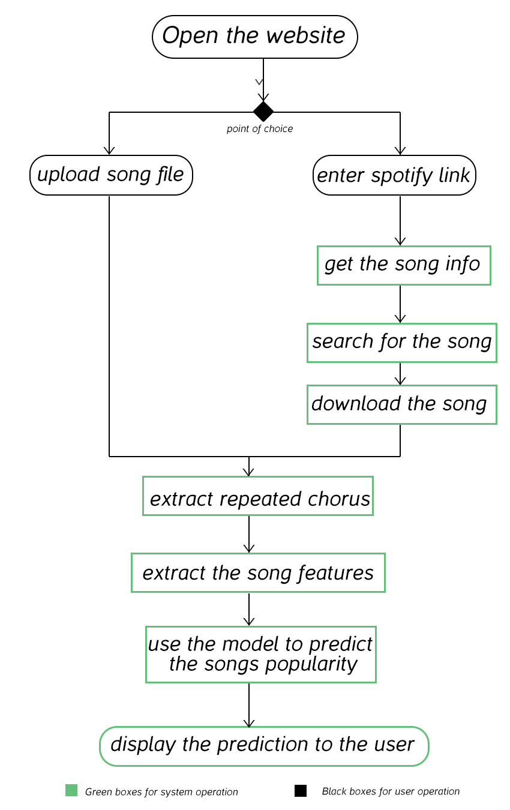
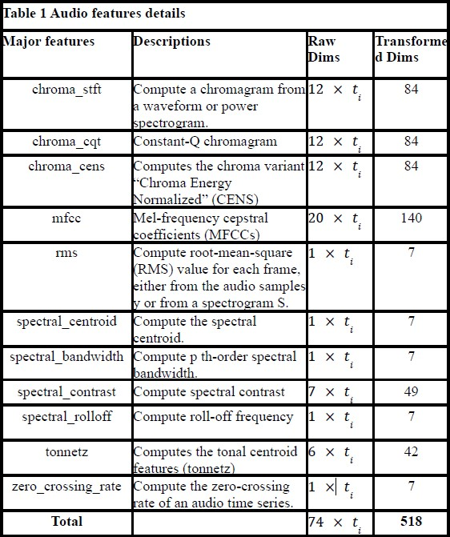
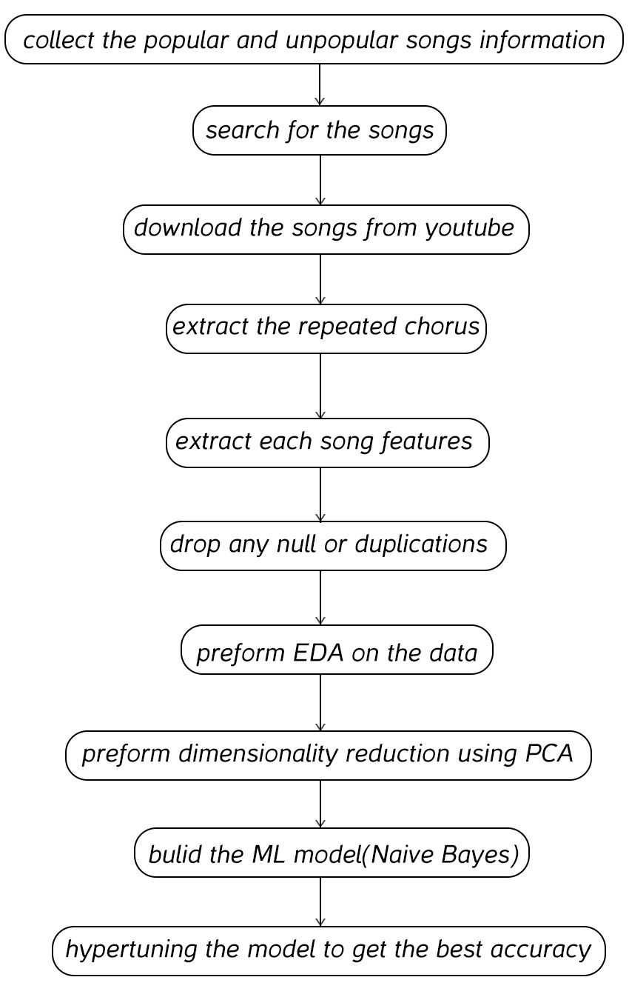
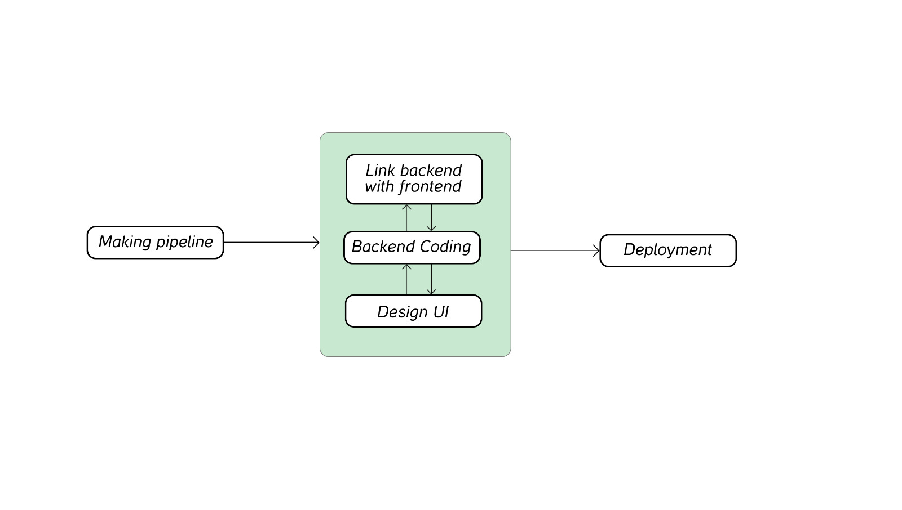

# Hit-Songs-Prediction-Web-App 

This is a Web Application Project, aims to Predict whether a new released song will became Popular or not, using Machine learning algorithms.

## Table of Contents

[Project Description](https://github.com/Technocolabs100/Building-a-Model-to-Predict-Hit-Songs-Using-Repeated-Chorus/tree/Team-A#project-description)

[Team Members](https://github.com/Technocolabs100/Building-a-Model-to-Predict-Hit-Songs-Using-Repeated-Chorus/tree/Team-A#prepared-by)

[Team Leads](https://github.com/Technocolabs100/Building-a-Model-to-Predict-Hit-Songs-Using-Repeated-Chorus/tree/Team-A#team-leads)

[Instructor](https://github.com/Technocolabs100/Building-a-Model-to-Predict-Hit-Songs-Using-Repeated-Chorus/tree/Team-A#instructor)

[Project Owner](https://github.com/Technocolabs100/Building-a-Model-to-Predict-Hit-Songs-Using-Repeated-Chorus/tree/Team-A#project-owner)

[Data Collection](https://github.com/Technocolabs100/Building-a-Model-to-Predict-Hit-Songs-Using-Repeated-Chorus/tree/Team-A#data-collection)

[Data Preprocessing](https://github.com/Technocolabs100/Building-a-Model-to-Predict-Hit-Songs-Using-Repeated-Chorus/tree/Team-A#data-preprocessing)

[EDA](https://github.com/Technocolabs100/Building-a-Model-to-Predict-Hit-Songs-Using-Repeated-Chorus/tree/Team-A#eda)

* [Visualization](https://github.com/Technocolabs100/Building-a-Model-to-Predict-Hit-Songs-Using-Repeated-Chorus/tree/Team-A#visualization)

* [Feature Distribution](https://github.com/Technocolabs100/Building-a-Model-to-Predict-Hit-Songs-Using-Repeated-Chorus/tree/Team-A#feature-distribution)

* [Statistical Analysis](https://github.com/Technocolabs100/Building-a-Model-to-Predict-Hit-Songs-Using-Repeated-Chorus/tree/Team-A#statistical-analysis)

* [Time-series Analysis](https://github.com/Technocolabs100/Building-a-Model-to-Predict-Hit-Songs-Using-Repeated-Chorus/tree/Team-A#time-series-analysis)

[Model Traning](https://github.com/Technocolabs100/Building-a-Model-to-Predict-Hit-Songs-Using-Repeated-Chorus/tree/Team-A#model-traning) 

[Model Evaluation](https://github.com/Technocolabs100/Building-a-Model-to-Predict-Hit-Songs-Using-Repeated-Chorus/tree/Team-A#model-evaluation) 

[Software Development Lifecycle](https://github.com/Technocolabs100/Building-a-Model-to-Predict-Hit-Songs-Using-Repeated-Chorus/tree/Team-A#software-development-lifecycle) 

* [Pipeline](https://github.com/Technocolabs100/Building-a-Model-to-Predict-Hit-Songs-Using-Repeated-Chorus/tree/Team-A#1-pipeline)

* [Front-End](https://github.com/Technocolabs100/Building-a-Model-to-Predict-Hit-Songs-Using-Repeated-Chorus/tree/Team-A#2-designing-the-uifront-end) 

* [Back-End](https://github.com/Technocolabs100/Building-a-Model-to-Predict-Hit-Songs-Using-Repeated-Chorus/tree/Team-A#3-coding-the-back-end)

* [Frontend and Backend Linkage](https://github.com/Technocolabs100/Building-a-Model-to-Predict-Hit-Songs-Using-Repeated-Chorus/tree/Team-A#4-link-the-backend-with-the-frontend) 

* [Deployment](https://github.com/Technocolabs100/Building-a-Model-to-Predict-Hit-Songs-Using-Repeated-Chorus/tree/Team-A#5-deployment)

[Improvements and Future Work](https://github.com/Technocolabs100/Building-a-Model-to-Predict-Hit-Songs-Using-Repeated-Chorus/tree/Team-A#Improvements-and-Future-Work) 

[Conclusion](https://github.com/Technocolabs100/Building-a-Model-to-Predict-Hit-Songs-Using-Repeated-Chorus/tree/Team-A#Conclusion) 

[How to Run](https://github.com/Technocolabs100/Building-a-Model-to-Predict-Hit-Songs-Using-Repeated-Chorus/tree/Team-A#how-to-run) 

[Acknowledgments](https://github.com/Technocolabs100/Building-a-Model-to-Predict-Hit-Songs-Using-Repeated-Chorus/tree/Team-A#acknowledgments) 
## Project Description
In this project, we will make a Web App to be used in predicting whether a new released song will get hit or not, by creating a data set of choruses from popular artists and applying supervised Machine Learning (ML) techniques to predict the popularity of their works purely based on the audio features extracted from the chorus.

The App will allow you to upload a song directly, or to enter a Spotify link.

## Prepared by
* Ahmed Wael
* Ahmed Emad 
* Aisha Amr 
* Aya Ahmed
* Basel Mahmoud
* Ezzat Mohammeed
* Farah Gamal
* Firdawse Guerbouzi
* Iptihal Yousri
* Somaya Ayman
* Yousef Shawky

## Team Leads
* Yousef Shawky (Lead)
* Iptihal Yousri (Co-Lead)

## Instructor
**Nour Ibrahim**

## Project Owner
**Yasin Shah**

## Data Collection 
We imported a list of the top 100 songs (Hot-100-songs) from billboard for the last 5 years. These 500 songs are labeled as Popular. 
Then we searched on Spotify for other tracks for the  existed artists in the popular set. These around 550 tracks found, are labeled as Unpopular.
After then, we used *yt_dlp* (YouTube-DL Plus) to search and download all the tracks from YouTube.

So, we may say that our data is nearly perfictly balanced between the two classes.

Finally, we had to extract the chorus from each track, we used *pychorus* library to make so.

At the next stage, we needed to extract several audio features from the chorus using *librosa* library. We selected 11 major spectral features for the analysis. Table 1 shows their name, description, and the number of dimensions.
The dimensions of the feature set for each track are also a function of ti , where ti  is a function of the duration of the chorus (in our case 15s) and the sampling rate of the soundtrack 𝑖. Since we do not want the duration or sampling rate to affect the prediction, we transformed the raw dimensions into 7 statistics, which are min, mean, median, max, std, skew, kurtosis. In total, each song track produces 518 audio features after the transformation.

## Data Preprocessing
At first, we dropped out the tracks that have no chorus, and dropped out any rows with a NULL value (they were only 2 of them).

Then, we scaled the data using both *MinMaxScaler* and *StandardScaler*.
We also dropped out some of the outliers.

And for the **Feature Selection**: As given a  large number of features and limited data size, we decided to apply the PCA projection first to reduce the dimensionality.
We had got **172** Principal Components (PC) that retains 95% of information of the original data.

## EDA
### Visualization:
* **Histograms** : to visualize the distribution of each MFCC or Chroma feature.
* **Box Plots** : to visualize the median, quartiles, and outliers of your audio features.
* **Heatmaps** : to visualize the correlation between different MFCC or Chroma features.

### Feature Distribution:
* **Kde-plots** : to estimate the probability density function of each audio feature.
* **Violin-plots** : to combine boxplots with KDE plots, providing a compact visualization of the distribution, quartiles, and probability density of the features.
### Statistical Analysis:
 we used **Lim-plots** to plot data and draw regression model fits across grids where multiple plots can be plotted.

### Time-series Analysis:
**Waveform Visualization** (Subplots): Plot the audio waveform to visualize the raw audio data.

## Model Selection
As a Team, our task was to select the best model from: Logistic Regression and Naïve Bayes algorithms.

Starting with the *Logistic Regression*, using different approaches as Grid Search and Bagging in modeling... Didn’t seem to make much difference. So, to keep it Simple... we Scaled the data by Standard Scaling and used the simplest form of the model.
And the best Accuracy we've got was 50% with f1 score = 0.50 .

**Members worked on this task:** (Individually)
* Ahmed Wael
* Basel Mahmoud
* Ezzat Mohammed
* Farah Gamal
* Firdawse Guerbouzi
* Yousef Shawky

Moving to the Second algorithm: the *Naïve Bayes*.
That one gave slight better results. We tried the Gaussian Naive Bayes, Bernoulli Naive Bayes, Multinomial Naive Bayes, and Complement Naive Bayes.
The Gaussian Naive Bayes one gave the best results and performance. So, we went with it.

**Members worked on this task:** (Individually)
* Ahmed Emad
* Aisha Amr
* Aya Ahmed
* Iptihal Yousri 
* Somaya Ayman 

## Model Traning
To increase the performance of the model, we used some hyperparameter tuning as: Bagging Classifier, specifying the n_estimators and the random_state values.

Moving to the next step, we have Split the Data into a dependent(Target: Y) variable ; which is the *Popularity*, and the rest of the PCAs’ are the independent variables(X). The Split is done by a ratio of 80:20 . 

## Model Evaluation
For evaluating the model, we counted mainly on the F1 score Metrics. As it combines the precision and recall scores of a model giving us a best performance spotting on our model. We kept our eyes on having a balanced scores for the two classes together.
So, the best Scores we got was: 67% for F1_score, and 61% for Accuracy.

Here is the Classification Report:

## Software Development Lifecycle

**Agile Methodology**

### 1-Pipeline:
    
We used the preprocessing (scaling, dimensionality reduction) and the model that gave the best f1_score and accuracy to make a pipeline and saved it to be used later in the prediction of each song the user enters.

*Task Holders:* Aya Ahmed , Iptihal Yousri

### 2-Designing the UI(Front-End):

We used HTML5 and CSS3 to make a static website that consists of 3 pages:

1. *Homepage*:  Contain a simple description about the website idea and two buttons to move to the other two webpages.
    * First button to go to the page that allows predicting the popularity of a song by uploading the song file.
    * Second button to go to the page that allows predicting the popularity of a song by entering only a Spotify link.

2. *Upload Song Page*:   On this page the user is allowed to upload the song file(.wav) and the website will predict if the uploaded song is popular or not.

3. *Spotify Link Page*:   On this page the user is asked to enter a Spotify song link and the website will predict if song is popular or not.

*Task Holders:* Aisha Amr , Somaya Ayman , Iptihal Yousri

### 3-Coding the Back-End:

This phase where the website is now capable of getting data and process it to predict the popularity of the target Song. Here is a list of the Backend functions:
* Function to get the song information in case of using to predict by Spotify link functionality.
* Function to download the song in case of using to predict by Spotify link functionality.
* Function to extract the repeated chorus from the song.
* Function to extract the song features.
* Function to predict using the saved pipeline.

*Task Holders:* Ezzat Mohammed , Farah Gamal , Firdawse Guerbouzi , Yousef Shawky

### 4-Link the Backend with the Frontend:

In this step we link the Frontend with the Backend and define the space where the prediction will be displayed.

*Task Holders:* Ezzat Mohammed , Farah Gamal , Firdawse Guerbouzi

### 5-Deployment:

We have faced many problems while deploying the project, due  to lack of the financial support, where it's nearly impossible to deploy the project with all its functionalities within the free  CPU limits given by the services providers.
We used the *python anywhere* server to deploy the Project. So, it’s production ready!

*Task Holders:* Ahmed Wael , Basel Mahmoud

## Improvements and Future Work:

* We will work to improve the model performance and accuracy.
* Add other Features to predict song popularity using other links not only the Spotify link.
* Predict song popularity using other files format not only the (.wav).
* Work on the UI to make it more visually eivdent

## Conclusion: 

Team A's hit songs prediction app is a promising new tool that can help music industry professionals identify potential hits. The app uses supervised learning to analyze song features to predict the likelihood of a song becoming a hit.

The app was trained on a dataset about 800 songs, and it has been shown to be accurate in predicting the success of new songs. In a recent study, the app correctly predicted the success of 67% of the songs that it was tested on,The app could help music labels identify new talent, and it could also help artists improve their chances of success.

In the future, Our team plans to continue to improve the accuracy of their app. They also plan to add new features.
Overall, Team A's hit songs prediction app is a valuable tool that has the potential to make a significant impact on the music industry.

## How to Run

It’s that easy... Just click the Link below!

https://starhacker21.pythonanywhere.com/

## Acknowledgments

I would like to express my sincere gratitude to Nour for her outstanding guidance and unwavering support throughout this project.
Thank you, Nour, for being an exceptional mentor and supervisor. Your contributions have left an indelible mark on this project's journey.

And of Course, much thanks for Technocolabs softwares especially Yasin Shah, for giving us that opportunity to learn and collaborate in that amazing project. 
